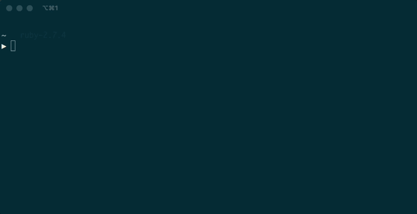

# Aocli

## TODO

## Installation

Add this line to your application's Gemfile:

```ruby
gem 'aocli'
```

And then execute:

    $ bundle install

Or install it yourself as:

    $ gem install aocli

## Usage

Once installed, the gem is ready to use. Simply navigate to directory that you are using to complete your Advent of Code challenges, this will be the directory that the boilerplate directories and files will be created.

    $ cd Projects/advent_of_code

Run `aocli` and follow the prompts. If you have not yet set your advent of code session token for aocli, you'll be asked to set it before you can generate any files. See the section, **How to get my Advent of Code session token**, to find out how you can retrieve this. This will be saved in the `~/aoc_token` file.



## Development

## TODO

After checking out the repo, run `bin/setup` to install dependencies. Then, run `rake spec` to run the tests. You can also run `bin/console` for an interactive prompt that will allow you to experiment.

To install this gem onto your local machine, run `bundle exec rake install`. To release a new version, update the version number in `version.rb`, and then run `bundle exec rake release`, which will create a git tag for the version, push git commits and tags, and push the `.gem` file to [rubygems.org](https://rubygems.org).

## Contributing

Bug reports and pull requests are welcome on GitHub at https://github.com/[USERNAME]/aocli. This project is intended to be a safe, welcoming space for collaboration, and contributors are expected to adhere to the [code of conduct](https://github.com/[USERNAME]/aocli/blob/master/CODE_OF_CONDUCT.md).


## License

The gem is available as open source under the terms of the [MIT License](https://opensource.org/licenses/MIT).

## Code of Conduct

Everyone interacting in the Aocli project's codebases, issue trackers, chat rooms and mailing lists is expected to follow the [code of conduct](https://github.com/[USERNAME]/aocli/blob/master/CODE_OF_CONDUCT.md).
